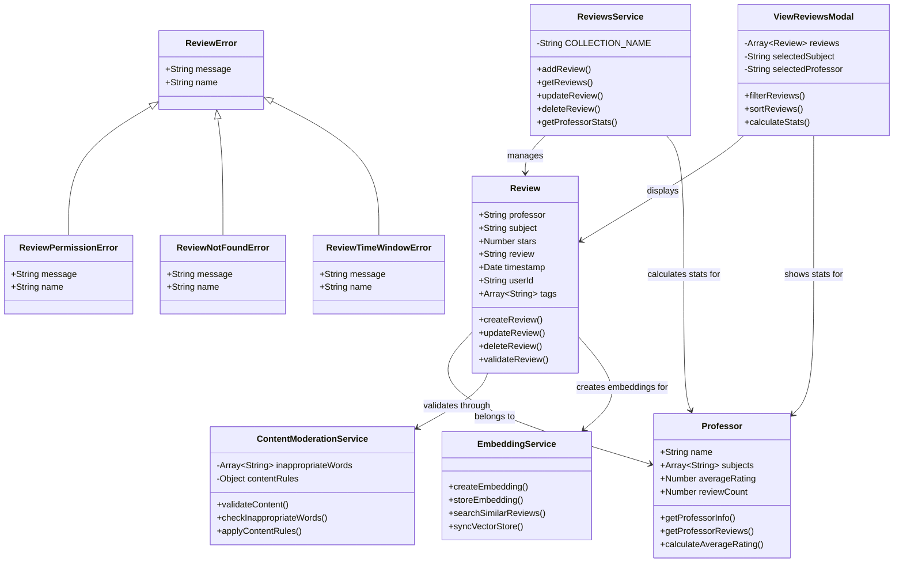
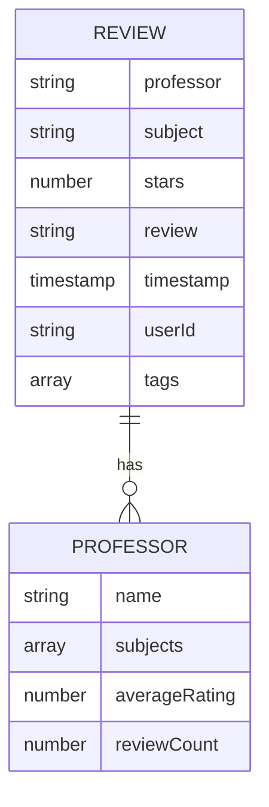
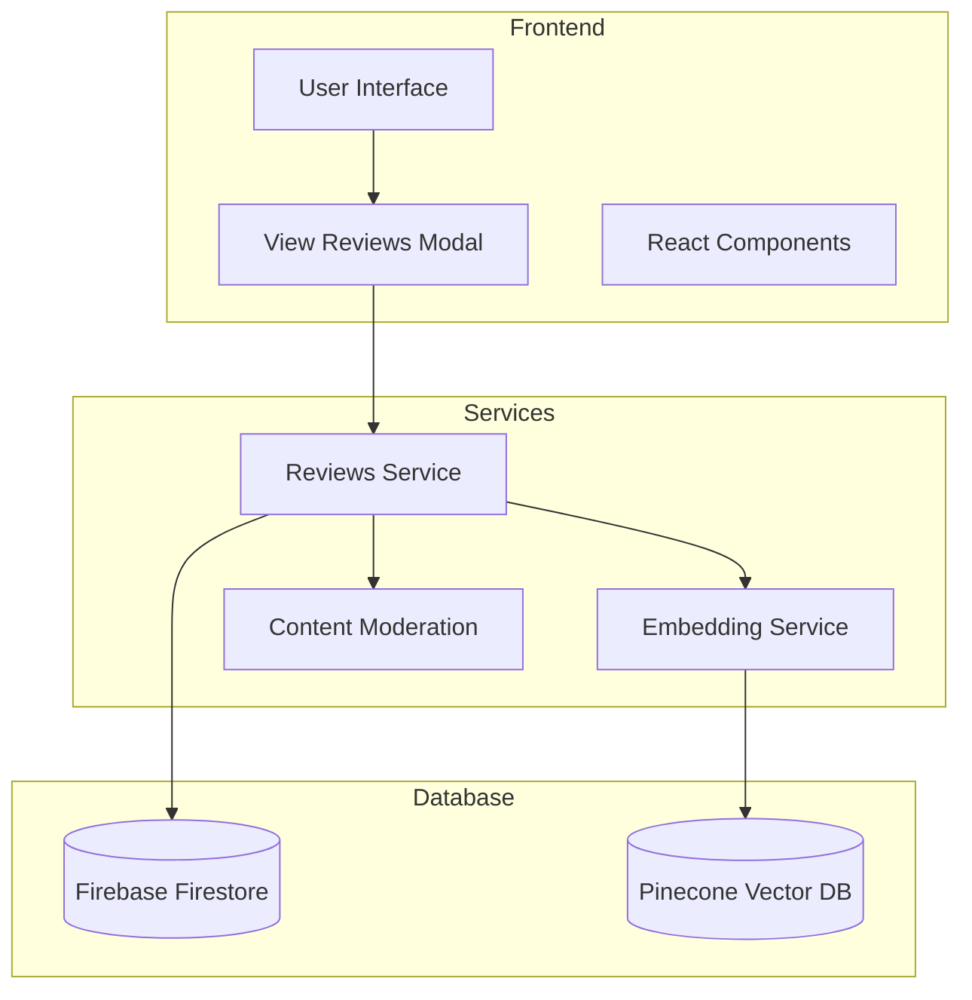

## Component Relationships

1. **Review Class**

   - Core entity representing a professor review
   - Contains review data and validation methods
   - Connected to Professor and various services

2. **Professor Class**

   - Represents a professor with their information
   - Contains methods for retrieving reviews and calculating statistics
   - Connected to Review and ReviewsService

3. **ContentModerationService**

   - Handles content validation and moderation
   - Contains rules and inappropriate words lists
   - Validates Review content

4. **EmbeddingService**

   - Manages vector embeddings for semantic search
   - Creates and stores embeddings for reviews
   - Handles vector store synchronization

5. **ReviewsService**

   - Manages review operations (CRUD)
   - Handles database interactions
   - Calculates professor statistics

6. **ViewReviewsModal**

   - UI component for displaying reviews
   - Handles filtering and sorting
   - Shows professor statistics

7. **Error Classes**
   - Hierarchy of error classes for review-related errors
   - Includes permission, not found, and time window errors

## Database Schema

## System Architecture

